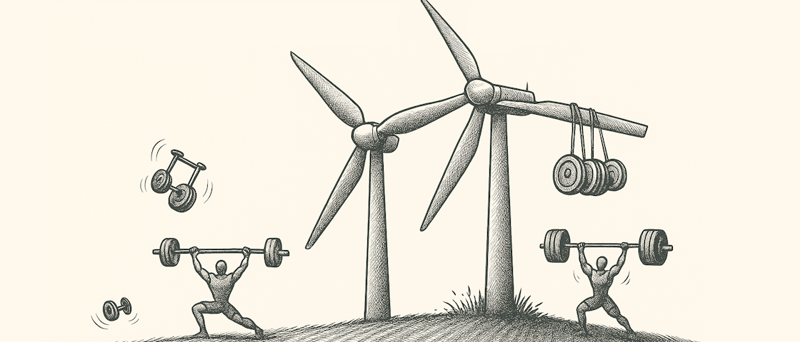

<p align="center">
  
</p>

<h1 align="center">WindGym</h1>

<p align="center">
  <b>Reinforcement Learning Environment for Wind Farm Control</b>
</p>

<p align="center">
  <a href="https://gitlab.windenergy.dtu.dk/sys/windgym/-/commits/main">
    
  </a>
  <a href="https://gitlab.windenergy.dtu.dk/sys/windgym/-/blob/main/LICENSE">
    
  </a>
  <a href="https://www.python.org/downloads/">
    
  </a>
  <a href="https://pixi.sh">
    
  </a>
</p>

---

## Overview

WindGym provides a dynamic wind farm environment for developing and evaluating reinforcement learning agents for wind farm control. Built on [DYNAMIKS](https://gitlab.windenergy.dtu.dk/DYNAMIKS/dynamiks) and [PyWake](https://gitlab.windenergy.dtu.dk/TOPFARM/PyWake), it enables agents to learn optimal turbine yaw control strategies for power maximization and load reduction in complex wake interactions.

**📚 [View the full documentation →](https://sys.pages.windenergy.dtu.dk/windgym/)**

---

## Key Features

- **Realistic Simulations**: High-fidelity wind farm dynamics using DYNAMIKS and PyWake
- **Flexible Environments**: Support for single-agent and multi-agent scenarios
- **Turbulence Modeling**: Mann turbulence boxes and realistic wind conditions
- **Multiple Turbine Models**: From simplified PyWake models to high-fidelity HAWC2 simulations
- **Baseline Agents**: Pre-built agents including PyWake optimizer, greedy, and random controllers
- **Comprehensive Evaluation**: Tools for comparing agents across various wind conditions
- **Noise & Uncertainty**: Built-in support for noisy measurements and uncertainty modeling
- **Curriculum Learning**: Support for progressive training strategies
- **Gymnasium Compatible**: Standard RL interface compatible with popular frameworks

---

## Quick Start

### Installation

```bash
git clone https://gitlab.windenergy.dtu.dk/sys/windgym.git
cd windgym
pixi install
pixi shell
```

For detailed installation instructions, see the [Installation Guide](https://sys.pages.windenergy.dtu.dk/windgym/installation).

### Basic Usage

```python
from WindGym.Wind_Farm_Env import WindFarmEnv

# Create a wind farm environment
env = WindFarmEnv(
    n_wt=3,  # Number of turbines
    ws=10.0,  # Wind speed (m/s)
    wd=270.0,  # Wind direction (degrees)
    TI=0.06,  # Turbulence intensity
)

# Run a simple episode
obs, info = env.reset()
for _ in range(100):
    action = env.action_space.sample()  # Random action
    obs, reward, terminated, truncated, info = env.step(action)
    if terminated or truncated:
        break

env.close()
```

### Evaluate a Baseline Agent

```python
from WindGym.Agents.PyWakeAgent import PyWakeAgent
from WindGym.FarmEval import FarmEval

# Create environment with evaluation wrapper
env = FarmEval(n_wt=3, ws=10.0, wd=270.0, TI=0.06)

# Use PyWake optimization as baseline
agent = PyWakeAgent(env)

# Run evaluation
obs, info = env.reset()
for _ in range(100):
    action, _ = agent.predict(obs)
    obs, reward, terminated, truncated, info = env.step(action)
    if terminated or truncated:
        break

# Get results
results = env.get_results()
print(f"Average power: {results['power'].mean():.2f} W")
```

---

## Examples

See the [examples directory](examples/) for complete demonstrations:

| Example | Description |
|---------|-------------|
| [Example 1](examples/Example%201%20Make%20environment.ipynb) | Create and configure environments |
| [Example 2](examples/Example%202%20Evaluate%20pretrained%20agent.ipynb) | Evaluate pre-trained RL agents |
| [Example 3](examples/Example%203%20load%20results%20from%20pre%20evaluated%20model.ipynb) | Analyze evaluation results |
| [Agent Comparison](examples/compare_agents_grid.py) | Compare multiple agents across wind conditions |
| [Noise Examples](examples/noise_examples/) | Working with measurement uncertainty |

<p align="center">
  
</p>

---

## Documentation

- **[Installation Guide](https://sys.pages.windenergy.dtu.dk/windgym/installation)** - Setup instructions
- **[Core Concepts](https://sys.pages.windenergy.dtu.dk/windgym/concepts)** - Understanding WindGym architecture
- **[Agents](https://sys.pages.windenergy.dtu.dk/windgym/agents)** - Creating custom control agents
- **[Evaluation](https://sys.pages.windenergy.dtu.dk/windgym/evaluations)** - Testing and comparing agents
- **[Noise & Uncertainty](https://sys.pages.windenergy.dtu.dk/windgym/noise-and-uncertainty)** - Robust agent development

---

## System Requirements

- **OS**: Linux (64-bit) or macOS (ARM64/Intel)
- **Python**: 3.7 - 3.11
- **RAM**: 8 GB minimum (16 GB recommended)
- **Disk**: 5 GB free space

---

## Contributing

We welcome contributions! Please see our [Contributing Guide](docusaurus-site/docs/developer-guidelines.md) for details on:

- Code of conduct
- Development workflow
- Pull request process
- Code style guidelines

---

## Citation

If you use WindGym in your research, please cite:

```bibtex
@software{windgym2023,
  title = {WindGym: Reinforcement Learning Environment for Wind Farm Control},
  author = {Nilsen, Marcus and Quick, Julian and Simutis, Ernestas and Åstrand, Teodor},
  year = {2023},
  url = {https://gitlab.windenergy.dtu.dk/sys/windgym}
}
```

---

## License

WindGym is released under the [MIT License](LICENSE).

Copyright (c) 2023 Technical University of Denmark (DTU)

---

## Support

- **Documentation**: https://sys.pages.windenergy.dtu.dk/windgym/
- **Issues**: https://gitlab.windenergy.dtu.dk/sys/windgym/-/issues
- **Discussions**: https://gitlab.windenergy.dtu.dk/sys/windgym/-/discussions

---

<p align="center">
  Developed by the <a href="https://windenergy.dtu.dk/">DTU Wind Energy Systems</a> group
</p>
